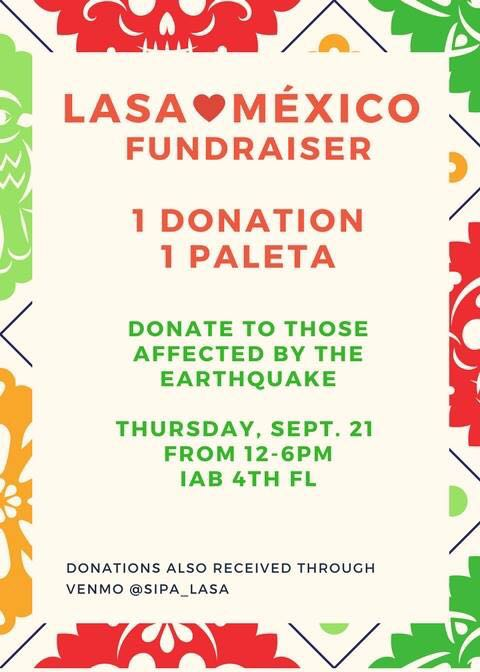

## Mexico needs your help

In September 9 and September 19, two earthquakes hit Mexico leaving thousands of victims. Mexican students in NYC are helping raise funds for several organizations that are assisting in relief tasks. There are many ways to donate.

For any inquiries contact me: e.blancas@columbia.edu

### Donate via Venmo

The following Venmo accounts are raising money:

* Latin American Student Association (@SIPA_LASA)
* Columbia Business School Students (@Mexico-CBShelp)

### Donate via Paypal

* Topos (search and rescue nonprofit) (donativos@brigada-rescate-topos.org)

### Donate via DirectRelief (Paypal and Credit Card)

* [Direct Relief](https://secure.directrelief.org/site/Donation2?df_id=2105&mfc_pref=T&2105.donation=form1&set.SingleDesignee=1923)

### Red Cross wishlist in Amazon Mexico (in Spanish)

* [See wishlist](https://www.amazon.com.mx/b?ie=UTF8&node=17290014011&pf_rd_p=59f95f2a-5084-4d96-a1c4-ffe45abcc16e&pf_rd_s=grid-1-takeover&pf_rd_t=Gateway&pf_rd_i=mobile&pf_rd_m=AVDBXBAVVSXLQ&pf_rd_r=3CQ3TF2BQ0WMHAMNSC7B&pf_rd_r=3CQ3TF2BQ0WMHAMNSC7B&pf_rd_p=59f95f2a-5084-4d96-a1c4-ffe45abcc16e)
